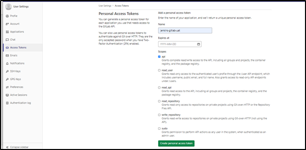

# **Integration-of-Jenkins-with-GitLab**

Integration-of-Jenkins-with-GitLab integration allows you to trigger a Jenkins build when a new code or new tag is pushed to a repository, or when a merge request is created.

Below are the steps we need to perform for integrating Jenkins with GitLab: -

1. ##### Install **Plugins** on the Jenkins server.

   We need to install the  below plugins for connecting our Jenkins server to GitLab: -

   - Git Plugin
   - Gitlab Plugin
   - Gitlab API plugin
   - Gitlab Authentication Plugin
   - Credentials Plugin

   We can install above Jenkins plugins by following below steps: -

   Open Jenkins ==> Go to manage Jenkins ==> Manage plugins ==> Go to Available plugins ==>

   Search plugins with the name of the respective plugins and install the same.

   

2. ##### Create a **User** with Developer permission or use an existing user. Also create a **Personal Access Token**.

   For creating a Personal Access token, we need to follow below steps: -

   Open GitLab ==> Click on User Menu at the right top of the page ==> Go to Settings ==>  Access Tokens ==> Create new token for Jenkins authentication.

   

   

   We should select API as Jenkins can access GitLab API's.

   

   

   Save the deployed token somewhere safe. Once you leave or refresh the page, you won’t be able to access it again.

   

3. ##### Add GitLab personal access token into Jenkins: -

   In Jenkins, we need to add the token which is created in GitLab for connecting Jenkins to Gitlab. Below are the steps: -

   Go to Jenkins ==> Manage Jenkins ==> Manage Credentials ==> Global Credentials ==> Add Credentials ==> Paste the API token which you have generated in previous step 2.

   

   

4. ##### Configure GitLab API setting on Jenkins: -

   We need to add our GITLAB server URL and appropriate token inside gitlab configuration.

   Go to Manage Jenkins ==> Configure System ==> Go to Gitlab Configuration section.

   Add the required details such as Name, Gitlab URL, token as per below image. Verify the connection by clicking on Test Connection.

   

   We can verify the successful Integration-of-Jenkins-with-GitLab by clicking on **Test Connection** button.

   