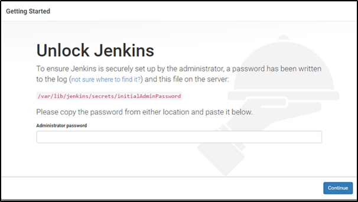
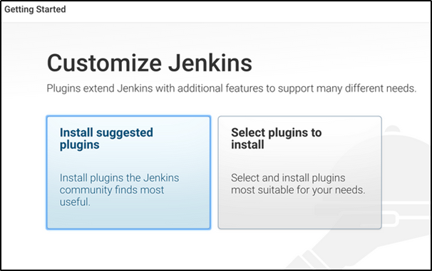
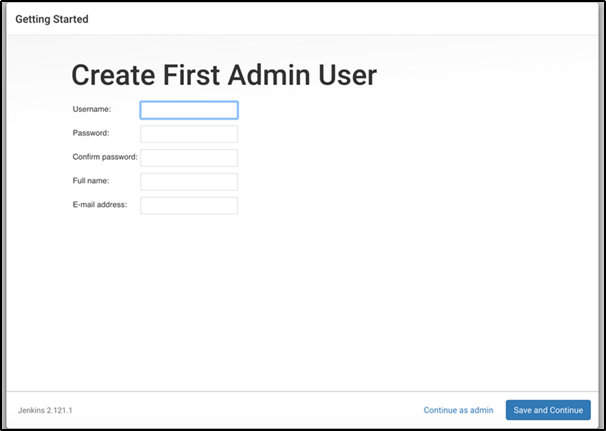
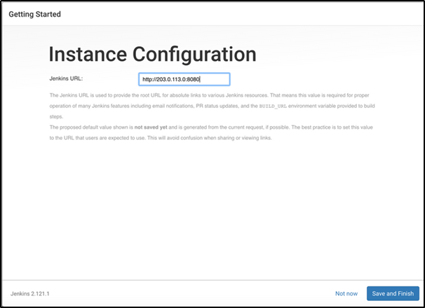

# Jenkins Installation

Prerequisites: -

1. Install Java
2. Minimum RAM should be 2GB or more.

### **Steps for Installing Jenkins: -**

1. Add the repository key to the system from below command:

   \$     *wget -q -O - https://pkg.jenkins.io/debian-stable/jenkins.io.key | sudo apt-key add –*

2. Append the Debian package repository address to the server’s sources.list:

   \$     *sudo sh -c 'echo deb http://pkg.jenkins.io/debian-stable binary/ > /etc/apt/sources.list.d/jenkins.list'*

3. After both commands have been entered, we’ll run `update` so that `apt` will use the new repository.

   \$     *sudo apt update*

4. We can install Jenkins by below command: -

   \$     *sudo apt install jenkins*

5. After the successful installation of Jenkins, we have to start the Jenkins by below command: -

   \$     *sudo systemctl start jenkins*

6. Since "*systemctl start*" doesn’t display status output, we have to use the "*systemctl status*" command to verify that Jenkins started successfully:

   \$     *sudo systemctl status jenkins*

   

   Now that Jenkins is up and running. We just need to make sure that firewall should allow port 8080.

   Now access the Jenkins from the browser by Public IP address of that machine on port 8080.

### Getting started with Jenkins: -

After successful installation of Jenkins, you can access the  Jenkins on any web server with the IP of server where we installed our Jenkins with the port number of 8080.

We need to follow below steps: -

1. In the terminal window of Jenkins server, use the `cat` command to display the password:

   \$     *sudo cat /var/lib/jenkins/secrets/initialAdminPassword*

   Copy the 32-character alphanumeric password from the terminal and paste it into the **Administrator password** field, then click **Continue**.

   

   

2. The next screen presents the option of installing suggested plugins or selecting specific plugins: 

   

   We’ll click the **Install suggested plugins** option, which will immediately begin the installation process.

   

   

3. When the installation is complete, you’ll be prompted to set up the first administrative user. It’s possible to skip this step and continue as `admin` using the initial password we used above, but we’ll take a moment to create the user.

   

   

4. You’ll receive an **Instance Configuration** page that will ask you to confirm the preferred URL for your Jenkins instance. Confirm either the domain name for your server or your server’s IP address:

   

After confirming the appropriate information, click **Save and Finish**. You’ll receive a confirmation page confirming that **“Jenkins is Ready!”**

