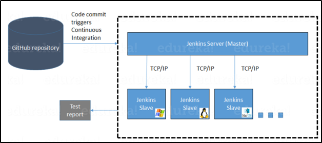

# Node(Slave) Creation in Jenkins

 Jenkins is an open-source automation tool written in Java with plugins built for Continuous Integration purposes. We should implement the distributed architecture in Jenkins because of the following issues: -

1. Sometimes you might need several different environments to test your builds. This cannot be done by a single Jenkins server.

2. If larger and heavier projects get built on a regular basis then a single Jenkins server cannot simply handle the entire load.

   In Jenkins distributed architecture, Jenkins uses a **Master-Slave** architecture to manage distributed builds. In this architecture, Master and Slave communicate through **TCP/IP** protocol.

   **Jenkins master**: - Jenkins master is the main server where we install our Jenkins.

   **Jenkins Slave**: - A Slave is a Java executable that runs on a remote machine. Following are the characteristics of Jenkins slave: -

   - It hears requests from the Jenkins master instance.
   - Slaves can run on a variety of Operating Systems.
   - The job of a Slave is to do as they are told to, which involves executing build jobs dispatched by the Master.
   - You can configure a project to always run on a particular Slave machine or a particular type of Slave machine, or simply let Jenkins pick the next available Slave.

   

   ### How Jenkins and Slave Architectures work?

   Now let us look at an example in which we use Jenkins for testing in different environments like Ubuntu, MAC, Windows, etc..

   The diagram below represents the same:

   

### How to setup Slaves: -

To setup Slaves, please follow below steps: -

1. Go to the Manage Jenkins section and scroll down to the section of Manage Nodes.

   

2. Click on New Node

3. Give a name for the node, choose the Permanent Agent option and click on Ok.

   

4. Enter the below details of the node slave machine. 

   - Here **no. of executers** in nothing but no. of jobs that this slave can run parallelly. Here we have kept it to 2. 
   - The **Labels** for which the name is entered as “Slave1” is what can be used to configure jobs to use this slave machine. 
   - Select **Usage** to Use this node as much as possible. 
   - For l**aunch method** we can select the option of “Launch agent by connecting it to the master” or "Launch agents via SSH". 
   - Enter **Custom WorkDir path** as the workspace of your slave node. 
   - In **Tunnel Connection through** of Advanced, we need to provide the Jenkins master IP with colon when we run a Jenkins behind a NGINX proxy.
   - In **Availability** select “Keep this agent online as much as possible”.
   - Click on **Save**.

   

5. After clicking on the save, you will get the Java command which you have to run on the remote server for connecting that server as slave to Jenkins master. Before running command, you  have to download agent.jar file into remote server. You can download the jar by running *wget* command. 